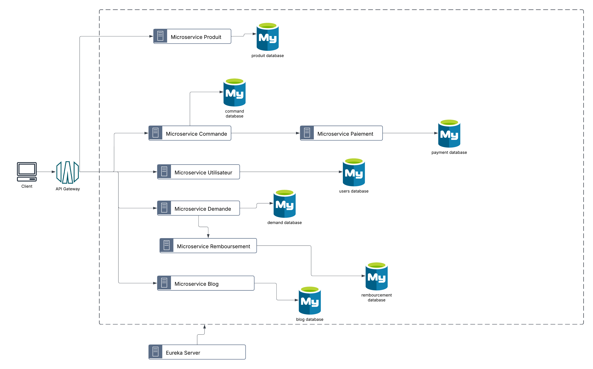
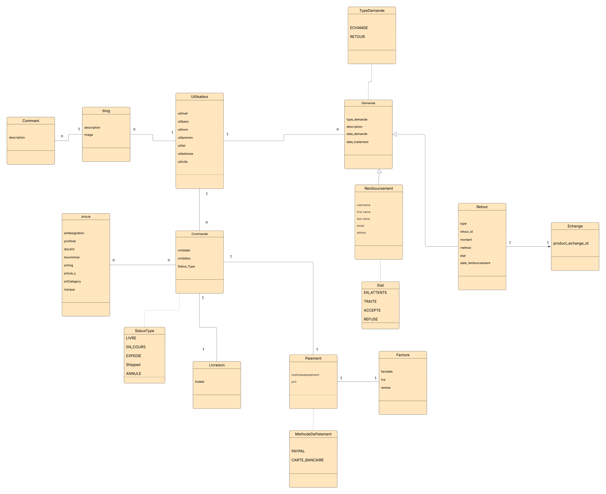

# Mini-Projet E-commerce - Architecture Microservices

## Description

Ce projet est une plateforme de e-commerce structurée selon les principes des **microservices**. L'objectif est de diviser l'application en plusieurs services indépendants, chacun étant responsable d'un domaine métier spécifique. Cela permet de garantir une architecture scalable, maintenable et résiliente, tout en offrant une grande flexibilité pour l'ajout de nouvelles fonctionnalités.

## Architecture de l'Application
Here are the key diagrams for the project:
### Architecture

### Class Diagram

### Microservices identifiés

1. **Service Produit** : 
   - Gère les articles et le catalogue de produits.
   - Responsable de l'ajout, de la modification et de la suppression de produits dans le stock.
   
2. **Service Commande** : 
   - Gère la création et la gestion des commandes des utilisateurs.
   - Interaction avec le service de paiement et le service de livraison.

3. **Service Paiement** : 
   - Responsable du traitement des paiements en ligne.
   - Gère la génération des factures après paiement.

4. **Service Retours & Échanges** : 
   - Gère les demandes de retour et d'échange de produits.
   - Prend en charge le remboursement dans le service de remboursement.
   
5. **Service Utilisateur** : 
   - Gère les comptes utilisateurs, l'authentification et la gestion des profils.

6. **Service Livraison** : 
   - Responsable de la gestion des livraisons et du suivi des colis.
   
7. **Service Blog** : 
   - Permet de créer et de gérer des articles de blog et les commentaires associés pour renforcer l'engagement des clients.

### Interactions entre les Microservices

- **Article → Commande** : Un article peut être lié à plusieurs commandes (relation One-to-Many).
- **Commande → Livraison** : Une commande est liée à une livraison (relation One-to-One).
- **Commande → Paiement** : Chaque commande est associée à un paiement (relation One-to-One).
- **Commande → Utilisateur** : Une commande est effectuée par un utilisateur (relation Many-to-One).
- **Paiement → Facture** : Chaque paiement génère une facture (relation One-to-One).
- **Demande → Echange** : Une demande de retour peut être associée à un échange de produit (relation One-to-One).
- **Demande → Retour** : Une demande de retour peut être associée à un retour de produit (relation One-to-One).
- **Retour → Remboursement** : Un retour peut générer un remboursement pour le client (relation One-to-One).

### Diagramme de Classes Global

Le diagramme de classes modélise la structure métier de l'application, avec les classes et leurs relations. Il est utilisé pour guider la conception des services et garantir que les différentes entités sont bien définies et interconnectées.

## Objectifs du Projet

- Appliquer les principes des microservices pour construire une application flexible et modulaire.
- Développer une architecture scalable où chaque microservice peut être déployé indépendamment.
- Implémenter une logique métier solide et bien structurée à travers le modèle de classes.

## Installation

1. Clonez ce repository :  
   `https://github.com/aminejmili10/MicroserviceProject.git`

2. Assurez-vous d'avoir Docker et Docker Compose installés sur votre machine pour gérer les microservices via des conteneurs.

3. Lancez l'application avec la commande suivante :  
   `docker-compose up`

## Technologies Utilisées

- **Java Spring Boot** pour les microservices backend.
- **Angular** pour le frontend.
- **Docker** pour la conteneurisation des services.
- **MySQL** pour la gestion des bases de données.
- **Kafka** ou **RabbitMQ** pour la communication asynchrone entre les microservices.

## Contribution

Les contributions sont les bienvenues ! Pour ajouter une fonctionnalité ou corriger un bug, créez une branche, effectuez vos modifications, puis soumettez une Pull Request.

